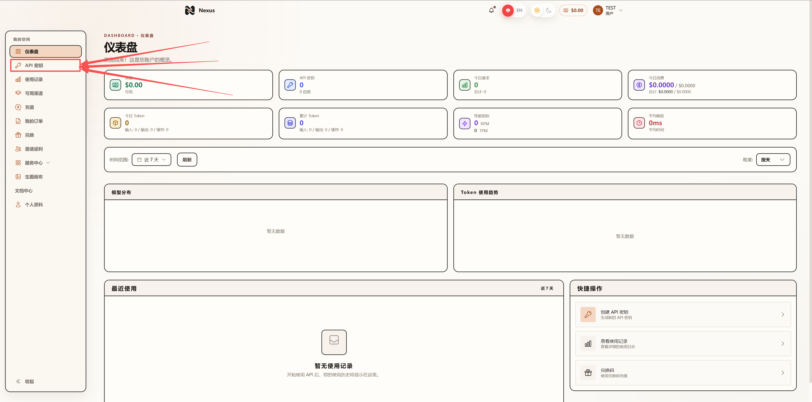

# 教程文档

1、登录Nexus AI

2、登录后界面如图所示，点击左侧的“API密钥”功能

3、点击后界面如图所示，点击“创建密钥”

4、创建密钥界面如图所示：

名称：自定义名称，可自己起一个便于自己分辨的名称，后续也可更改

厂商：请选择自己需要使用的厂商

需要在Claude code中使用，推荐选择”Anthropic”

需要在CodeX中使用，推荐选择”OpenAI”

如果需要使用除Deepseek外的国产模型，也请选择”OpenAI”厂商

分组：选择不同分组的模型进行使用，分组不同会影响价格/性能，具体如何选择分组可查看“123”

一切选择妥当后点击”创建”

5、创建完成后如图所示：

1、如果您熟悉API调用命令/配置等内容，请点击“使用密钥”

2、如果您并不熟悉，推荐使用”CC Switch”软件配套使用，请下载安装好”CC Switch”软件后点击“导入到CCS”，跳转到CC Switch后显示如下，点击”导入”

6、导入完成后，CC Switch软件会显示如图内容：

点击“启用”即可应用配置

点击“启用”右侧图标即可进行进一步的配置，进一步配置如下：点击”高级选项”按钮，后向下滑动，进行进一步的选择

高级选项如图所示：

此处如图所示按顺序点击，首先点击获取模型列表，即可拉取服务器最新可供使用的模型列表

拉取到模型列表后，即可出现图中”2”按钮，点击即可显示刚刚拉取到的模型列表，可根据自己的需要选择不同的模型使用

选择好模型后再点击图中”3”按钮，即可一键设置完成，完成后保存即可

